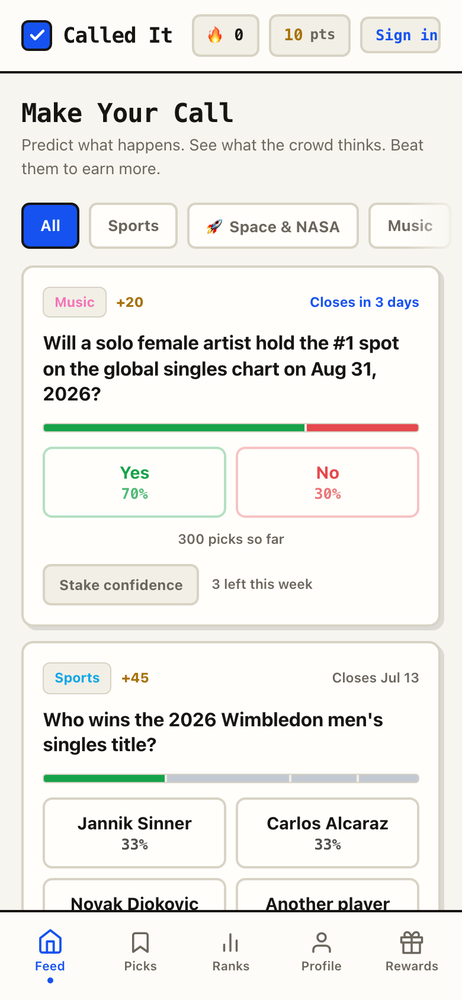
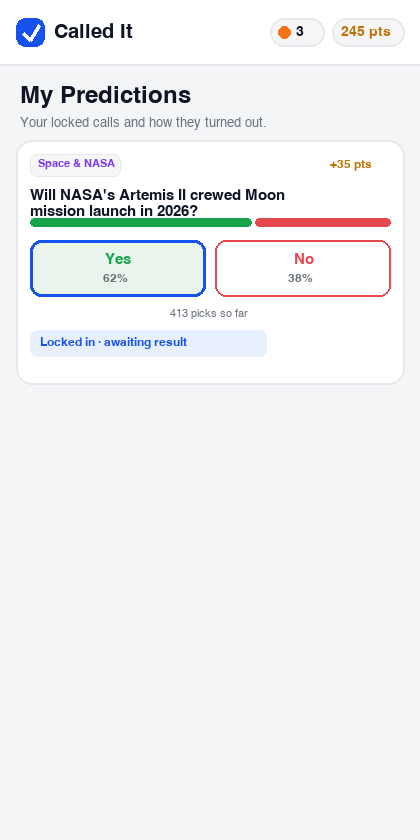
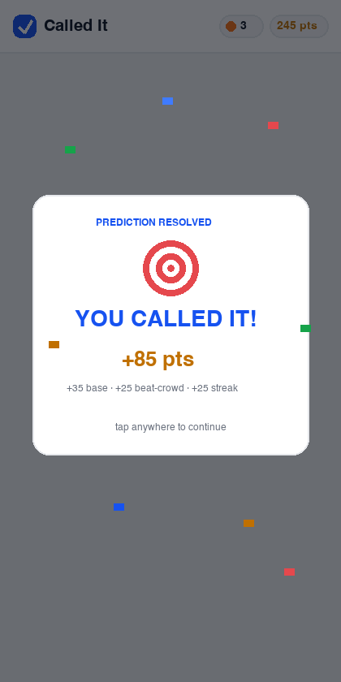

# Called It

**A free, no-money prediction game where you call what happens next and earn points for being right.**

[](https://prajith-vishnu.github.io/called-it/)
[](https://github.com/prajith-vishnu/called-it/actions/workflows/ci.yml)
[](LICENSE)

## See it

| The feed | Locked in | Called it 🎉 |
|:---:|:---:|:---:|
|  |  |  |

<!-- Optional demo GIF — drop docs/demo.gif in and un-comment:

-->

## What it is

Called It is a free prediction game inspired by prediction markets like **Polymarket** and **Kalshi** — but with **zero money involved**. Instead of betting cash, you predict the outcome of fun future events and earn **points and status** for being right. No wagering, no prizes, no payouts — the only reward is bragging rights and climbing the ranks.

## Built for Stardance 🌌

This project was built for **Stardance** (Hack Club's NASA-themed challenge). It ships a dedicated **🚀 Space & NASA category** — Artemis II, Starship orbital tests, Moon landings, launch-count races, astronaut records — resolved exactly like every other question, and the AI generator is prompted to keep producing fresh space predictions on schedule. Calling the future of spaceflight *is* the game.

## For judges — the 2-minute tour

1. **Play it** (zero setup): open [`index.html`](index.html) or the live demo below — pick outcomes, build streaks, watch the confetti.
2. **Run the full stack** (accounts + live leaderboard): `cd server && cp ../.env.example .env` (add a free [Groq key](https://console.groq.com/keys)) `&& npm start`, then visit `http://localhost:3000` and hit **Sign in**.
3. **Prove the pipeline is alive**: `curl localhost:3000/api/health` — last AI run, last error, calls-today vs. the hard daily cap.
4. **Prove the security posture**: `curl -i localhost:3000/server/.env` → 404 (allowlisted static serving); `npm audit` → 0 vulnerabilities (zero dependencies); passwords scrypt-hashed, sessions httpOnly, CSRF-guarded, everything rate-limited. Details in [server/README.md](server/README.md).

## Features

- 🗳️ **Prediction feed** across many categories (sports, 🚀 **space & NASA**, music, movies/TV, internet & creators, awards, viral trends, "will it happen")
- 👤 **Optional accounts** — username + password only (**no email, no personal data**); or play as a guest entirely on-device
- 🏆 **Live leaderboard** — scores are computed **on the server** from real picks, so nobody can cheat their way up; cached so it stays fast
- 📅 **Daily check-in streaks** — come back every day for growing bonus points; miss a day and the streak gently resets
- 🎯 **Points** for correct calls, 🔥 **call streaks** with stacking bonuses
- 🧠 **Beat-the-crowd bonus** — correctly picking the *unpopular* option earns extra (rewarding independent thinking, like buying low in a real market)
- ⚡ **Opt-in confidence stakes** — 3 per week; win more, or lose the stake (the only way to lose points; casual players never get punished)
- ✨ **Ranks, themes, titles, and badges** unlocked purely by milestones — never bought, never for sale
- 📊 **Real crowd-belief bars** — signed-in feeds show live tallies aggregated from everyone's actual picks
- 🤖 **AI-refreshed questions several times a day**, safety-filtered, always served from cache — the AI being down never takes the game down
- 🎉 **"You vs. the crowd" reveals** — every resolve tells the story: *"Only 21% said Yes — you saw it coming"* gets gold-flair celebrations; misses get a gentle *"Not this time"*
- 📖 **Your prediction story** — profile shows your best category and, after 10 resolved calls, a locally-computed **prediction personality** (The Contrarian, Streak Hunter, Space Cadet…) — nothing leaves the device
- 📣 **Visual share cards** — one tap draws a branded image card of your call (or your stats) on a canvas and shares it via the system share sheet, clipboard, or download; space calls get a starfield 🌌; never anything personal on the card
- 🗓️ **Calling streaks & urgency** — a separate "made a call today" streak rewards showing up, and predictions closing within 24h pulse *⏳ Closes in Nh* at the top of the feed
- 📲 **Installable PWA** — add it to your phone's home screen; the service worker keeps it fully playable offline from cache
- ✅ **Tested + CI** — a zero-dependency `node:test` suite runs the *exact* scoring engine shipped in `index.html` (extracted and executed in a VM) on every push

## How it works

1. Browse open predictions and **tap an option** to lock in your call.
2. When a question's close date passes, the scheduled pipeline asks the AI
   (with web search) to resolve it. An outcome is applied **only** if the AI
   reports a clear-cut, well-sourced result with high confidence — it is
   instructed to answer "unresolved" rather than guess. Everything below that
   bar lands in a review queue for **manual resolution by the maintainer**,
   who can also set or override any outcome directly. In short: conservative
   AI-assist for the obvious cases, a human for everything else.
3. **Correct calls earn points** (plus beat-the-crowd, streak, and confidence
   bonuses); climb the ranks, unlock cosmetics, and defend your leaderboard
   spot.

## Architecture

```
┌──────────────────────── index.html (no framework, no build) ───────────────────────┐
│  DATA (content/config) · LOGIC (Store + pure Game engine) · UI (render + FX)       │
│  + Net/Account layer: signs in, mirrors server state, pushes picks                 │
└─────────────────────────────────────────────────────────────────────────────────────┘
                       │ same-origin JSON API (httpOnly session cookie)
┌──────────────────────▼───────────── server/ (zero dependencies) ────────────────────┐
│  auth (scrypt + sessions) · game (server-side scoring, cached leaderboard, daily    │
│  streaks) · db (atomic JSON store) · refresh pipeline (scheduled Groq calls,        │
│  triple rate-guarded, safety-filtered, cache-only) · /api/health                    │
└──────────────────────────────────────────────────────────────────────────────────────┘
```

- **Guest mode needs no backend at all** — GitHub Pages + the Actions cron
  committing `predictions.json` keeps the static experience alive forever.
- **The full experience** (accounts, live leaderboard, real crowd bars, synced
  streaks) comes from running `server/` on any Node host.
- The client **Store contract** and server **db adapter** are both designed as
  swap points: the front-end could move to a native app, and the JSON store to
  Postgres, without touching game logic.

## Privacy & safety

- **Guest mode:** nothing personal collected, everything stays in your browser's localStorage.
- **Accounts:** exactly a username (content-filtered), a **scrypt-hashed** password, and your picks. **No email**, no analytics, no trackers. See [PRIVACY.md](PRIVACY.md).
- **No user-generated text** visible to others except filtered usernames — no chat, no messaging, nothing to moderate.
- **Family-friendly content, enforced twice:** the AI is prompted for all-ages content *and* every generated question passes a strict server-side safety filter (mirrored client-side) before anyone sees it. Failures are discarded.

## Security highlights

- **Secrets:** the Groq key + admin token live only in env / GitHub Actions Secrets — never in code, responses, logs, or git history (verified).
- **Passwords** hashed with scrypt (memory-hard, OWASP-recommended); **sessions** are random 256-bit tokens stored only as hashes, in httpOnly `SameSite=Strict` (Secure in prod) cookies.
- **CSRF protection** (same-site cookies + Origin/Sec-Fetch-Site checks), **rate limiting** on every endpoint plus sliding-window brute-force limits on login/register, **16 KB body cap**, strict **CSP** and security headers, **allowlisted static serving** (secret files are unreachable by construction).
- **The AI can never hurt the app:** calls run only from the scheduled server-side job, capped at 40/day locally *and* budget-guarded by Groq's own headers *and* spaced by a min interval — with exponential-backoff retries and a cache that keeps serving through any failure. `GET /api/health` proves the pipeline is alive.
- **Zero npm dependencies** → `npm audit`: 0 vulnerabilities, by construction.

## Run locally

Static demo (guest mode) with no setup:

```bash
open index.html        # or double-click it
```

Full experience (accounts + live leaderboard + AI refresh):

```bash
cd server
cp ../.env.example .env    # then edit .env:
#   GROQ_API_KEY=...            from https://console.groq.com/keys (free)
#   ADMIN_REFRESH_TOKEN=...     any long random string
npm start                  # http://localhost:3000 — game, API, and scheduler
```

Check the pipeline: `curl localhost:3000/api/health`. Requires Node ≥ 20.6.
For production, set `NODE_ENV=production` (Secure cookies + HSTS) and run under
pm2/systemd so crashes self-heal. Full backend docs: [server/README.md](server/README.md).

## Live demo

▶️ **<https://prajith-vishnu.github.io/called-it/>** — live now, refreshed with new AI predictions on schedule (installable as an app from your phone's browser)

## Credits

Designed and built by **Prajith Vishnu**. [Claude](https://claude.com) (Anthropic's AI) was used as a coding assistant to help write this website's code; the concept, game design, product direction, and every final decision are my own.

## License

[MIT](LICENSE) © 2026 Prajith Vishnu

---

_Called It is a for-fun, cosmetic-only game. Points and ranks have no monetary or real-world value and cannot be bought, sold, or redeemed._
